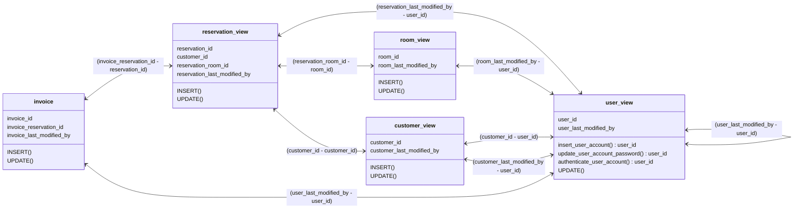

# TravelNest Database
### [Starting DB container](/DB_startup.md)

# Spis treści
1. [Struktura](#1-struktura)
    1.  [Wewnętrzna](#11-wewnętrzna)
         1. [Rezerwacje](#111-rezerwacje)
         2. [Pokoje](#112-pokoje)
         3. [Klienci](#113-klienci)
         4. [Faktury](#114-faktury)
         5. [Użytkownicy](#115-użytkownicy)
    2.  [Zewnętrzna](#12-zewnętrzna)
         1. [Odniesienia](#121-odniesienia)
         2. [Modyfikacja danych](#122-modyfikacja-danych)
            1. [reservation_view](#1221-reservation_view)
            2. [room_view](#1222-room_view)
            3. [customer_view](#1223-customer_view)
            4. [invoice_view](#1224-invoice_view)
            5. [user_view](#1222-room_view)

# 1. Struktura 

## 1.1. Wewnętrzna
Struktura wewnętrzna bazy składa się z 7 tabel głównych i 4 tabel - słowników.
**Tabele główne** są modelem, który opisuje fragment działalności hotelu, związany z realizowaniem rezerwacji przez klientów. **Tabele słowniki** są tabelami pomocniczymi, które przechowują statusy rekordów w poszczególnych modułach systemu bazy danych.

Tabele główne:
- `reservation` - przechowuje wszystkie rezerwacje
- `reservation_room` - łączy rezerwacje, z pokojami które są rezerwowane
- `room` - reprezentuje pokoje w hotelu
- `room_type` - przechowuje charakterystyki pokoi, liczbę dostępnych łóżek, ceny i inne udogodnienia
- `user_account` - przechowuje konta użytkowników systemu
- `user_details` - przechowuje dane kontaktowe klientów
- `invoice` - reprezentuje faktury wystawiane do zamówień

Tabele słowniki:
- `dict_reservation_status`
- `dict_reservation_room_status`
- `dict_room_status`
- `dict_invoice_status`

### 1.1.1 Rezerwacje
Na rezerwację składają się:
- dane klienta, który dokonuje rezerwacji (**klucz obcy** do tabeli `user_account` a następnie `user_details`)
- szczegóły rezerwacji (**kolumny** w tabeli `reservation`):
    - liczba gości - dorośli
    - liczba gości - dzieci
    - data rozpoczęcia wizyty
    - data zakończenia wizyty
- zarezerwowane pokoje (**klucz obcy** do tabeli pomocniczej `reservation_room`)

### 1.1.2 Pokoje
Na pokój składa się:
- tabela reprezentująca faktyczne pokoje znajdujace się w hotelu `room`
- charakterystyka pokoju (**klucz obcy** do tabeli `room_type`):
  - ilość łóżek
  - ceny
  - pozostałe udogodnienia 

### 1.1.3 Klienci
Na profil klienta składa się:
- tabela przechowywująca konta użytkowników `user_account`
- tabela przechowywująca dane klientów `user_details`

### 1.1.4 Faktury
Na fakturę składa się:
- tabela reprezentująca faktyczne dokumenty `invoice`
- relacje do uzyskania niezbędnych dancyh w celu wystawienia dokumentu:
  - **klucz obcy** do tabeli `reservation`:
    - okres czasu na jaki pokoje zostały udostępnione
    - **klucz obcy** do tabeli  `reservation_room` (określenie jakich pokoi dotyczy faktura)
    - **klucz obcy** do tabeli `user_account` i `user_details` (określenie nabywcy)

### 1.1.5 Użytkownicy
Użytkownikiem jest zarówno administrator jak i osoba rezerwująca pokój.
Administrator jest oznaczony specjalną flagą `is_admin`.
Administrator nie musi mieć wypełnionych danych w tabeli `user_details`.

## 1.2. Zewnętrzna
Struktura zewnętrzna bazy danych (widziana przez `Backend`) składa się z 5 widoków, które można ze sobą łączyć.

### 1.2.1 Odniesienia

Podstawowe operacje jak aktualizowanie istniejących danych czy wprowadzanie nowych,
realizuje się za pomocą standardowych instrukcji `UPDATE` czy `INSERT`.
Wyjątkiem są operacje związane z user_view.

### 1.2.2 Modyfikacja danych
Tabele poniżej przedstawiają które pola widoków i jaką instrukcja można modyfikować.

Pole `_last_modified_at` nie można modyfikować, ponieważ jest ono odświeżane automatycznie podczas wykonywania innych operacji.

Pole `_last_modified_by` w każdej tabeli odnosi się do `user_ID` z widoku `user_view`.

Wszystkie pola z suffixem `_id` muszą zawierać wartości istniejące w tabelach powiązanych kluczem obcym,
wszystkie odwołują się do pola o nazwie `ID` w tabelach jak poniżej.

| Nazwa kolumny w widoku         |      Widok       |            Tabela            |    Dostępne w widoku    |
|--------------------------------|------------------|------------------------------|-------------------------|
| reservation_customer_id        | reservation_view | user_account                 | customer_view           |
| reservation_status_id          | reservation_view | dict_reservation_status      | --                      |
| reservation_room_id            | reservation_view | room                         | --                      |
| reservation_room_status_id     | reservation_view | dict_reservation_room_status | --                      |
| room_type_id                   | room_view        | room_type                    | room_view               |
| room_status_id                 | room_view        | dict_room_status             | --                      |
| customer_id                    | customer_view    | user_account                 | customer_view           |
| invoice_status_id              | invoice_view     | dict_invoice_status          | --                      |
| invoice_reservation_id         | invoice_view     | reservation                  | reservation_view        |

#### 1.2.2.1 reservation_view
| Nazwa kolumny w widoku         |  UPDATE | INSERT  |
|--------------------------------|---------|---------|
| reservation_id                 |         |         |
| reservation_customer_id        |         |    X    |
| reservation_status_id          |    X    |         |
| reservation_number_of_adults   |    X    |    X    |
| reservation_number_of_children |    X    |    X    |
| reservation_start_date         |    X    |    X    |
| reservation_end_date           |    X    |    X    |
| reservation_room_id            |    X    |    X    |
| reservation_room_status_id     |    X    |         |
| reservation_last_modified_by   |    X    |    X    |
| reservation_last_modified_at   |         |         |

- `reservation_id` <- generowane automatycznie.
- `reservation_customer_id` <- przepisanie rezerwacji do klienta jest możliwe tylko podczas tworzenia rezerwacji.
- `reservation_status_id` <- podczas operacji `INSERT` ustawiana jest wartość domyślna (pozycja 1. w `dict_reservation_status`).
- `reservation_room_status_id` <- podczas operacji `INSERT` ustawiana jest wartość domyślna (pozycja 1. w `dict_reservation_room_status`).

#### 1.2.2.2 room_view
| Nazwa kolumny w widoku     |  UPDATE | INSERT  |
|----------------------------|---------|---------|
| room_id                    |         |    X    |
| room_type_id               |    X    |    X    |
| room_status_id             |    X    |         |
| room_number_of_single_beds |         |         |
| room_number_of_double_beds |         |         |
| room_number_of_child_beds  |         |         |
| room_gross_price           |    X    |    X    |
| room_gross_price_adult     |         |         |
| room_gross_price_child     |         |         |
| room_photos_dir            |         |         |
| room_last_modified_by      |    X    |    X    |
| room_last_modified_at      |         |         |

- `room_id` <- zmiana numeru pokoju po jego wprowadzeniu nie jest możliwa.
- `room_status_id` <- podczas operacji `INSERT` ustawiana jest wartość domyślna (pozycja 1. w `dict_room_status`).
- Poniższe pola są zależne od rodzaju pokoju i nie można ich modyfikować poprzez room_view:
  - `room_number_of_single_beds`
  - `room_number_of_double_beds`
  - `room_number_of_child_beds`
  - `room_gross_price_adult`
  - `room_gross_price_child`
  - `room_photos_dir`

#### 1.2.2.3 customer_view
| Nazwa kolumny w widoku    |  UPDATE | INSERT  |
|---------------------------|---------|---------|
| customer_id               |         |    X    |
| customer_nip_number       |    X    |    X    |
| customer_name             |    X    |    X    |
| customer_surname          |    X    |    X    |
| customer_email            |         |         |
| customer_phone            |    X    |    X    |
| customer_city             |    X    |    X    |
| customer_postal_code      |    X    |    X    |
| customer_street           |    X    |    X    |
| customer_building_number  |    X    |    X    |
| customer_last_modified_by |    X    |    X    |
| customer_last_modified_at |         |         |

- `customer_id` <- należy podać `ID` `user_account`, do które dane adresowe mają być przypisane, później nie można przypisać tych danych do innego użytkownika.
- `customer_email` <- jest wartością niezbędną do autentykacji użytkowników - klientów, więc jego modyfikacja jest możliwa tylko za pośrednictwem `user_view`.

#### 1.2.2.4 invoice_view
| Nazwa kolumny w widoku |  UPDATE | INSERT  |
|------------------------|---------|---------|
| invoice_id             |         |         |
| invoice_reservation_id |         |    X    |
| invoice_date           |         |         |
| invoice_price_gross    |    X    |    X    |
| invoice_is_paid        |    X    |         |
| invoice_status_id      |    X    |         |
| user_last_modified_by  |         |    X    |
| user_last_modified_at  |         |         |

- `invoice_id` <- generowane automatycznie.
- `invoice_reservation_id` <- modyfikowana tylko podczas operacji `INSERT`, ponieważ nie można przepisać faktury z jednego zamówienia na inne.
- `invoice_reservation_id` <- generowane automatycznie.
- `invoice_is_paid` <- podczas operacji `INSERT` ustawiana jest wartość domyślna (FALSE).
- `invoice_status_id` <- podczas operacji `INSERT` ustawiana jest wartość domyślna (pozycja 1. w `dict_invoice_status`).

#### 1.2.2.5 user_view
| Nazwa kolumny w widoku |  UPDATE | INSERT  |
|------------------------|---------|---------|
| user_id                |         |         |
| user_e_mail            |    X    |         |
| user_name              |    X    |         |
| user_is_active         |    X    |         |
| user_is_admin          |    X    |         |
| user_last_modified_by  |    X    |         |
| user_last_modified_at  |         |         |

- `user_id` <- generowane automatycznie.

Poniższe operacje nie są możliwe do wykonania przy użyciu instrukcji `UPDATE` czy `INSERT`.
- utworzenie nowego użytkownika
    - funkcja `insert_user_account(login, user_password, last_modified_by_id)` - 
        hasła nie są dostępne z poziomu `user_view`, 
        więc żeby zapobiec ich udostępnianiu wprowadzanie nowych użytkowników odbywa się za pomocą osobnej funkcji.
        **Funkcja zwraca** `ID` nowego użytkownika, jeśli operacja zakończy się sukcesem.
        - login <- dowolnie username lub e-mail, funkcja sama rozpoznaje i wprowadza w wartość do odpowiedniej kolumny w tabeli
        - user_passoword <- hasło do autentykacji dla tworzonego użytkownika
        - last_modified_by_id <- id użytkownika, który tworzy wpis. Jeśli podany będzie `NULL` zostanie to zinterpretowane, jakby użytkownik sam założył konto.

- zmiana hasła
  - funkcja `update_user_account_password(login, new_user_password, old_user_password, last_modified_by_id)`
    **Funkcja zwraca** ID użytkownika, jeśli operacja przebiegła pomyślnie, w przeciwnym wypadku zwraca null oraz błąd.
    - login <- dowolnie username lub e-mail, funkcja sama rozpoznaje i sprawdza wartość z odpowiedniej kolumny.
    - new_user_passoword <- nowe hasło które chcemy ustawić 
    - old_user_passoword <- stare hasło do autentykacji użytkownika
    - last_modified_by_id <- id użytkownika, który dokonuje zmiany, 
        użytkownik, który nie jest adminem nie może zmienić hasła innemu użytkownikowi,
        jeżeli podany id odpowiada adminowi poprawność starego hasła nie jest sprawdzana.

- autentykacja istniejącego użytkownika za pomocą loginu i hasła:
    - funkcja `authenticate_user_account(login, user_password)` - 
        **Funkcja zwraca** ID użytkownika, jeśli autentykacja przebiegła pomyślnie, 
            w przeciwnym wypadku zwraca null i/oraz błąd, jeśli użytkownik nie istnieje.
        - login <- dowolnie username lub e-mail, funkcja sama rozpoznaje i sprawdza wartość z odpowiedniej kolumny.
        - user_passoword <- hasło do autentykacji dla tworzonego użytkownika

# 2. Weryfikacja danych