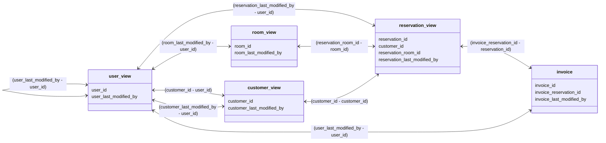

# TravelNest Database
### [Starting DB container](/DB_startup.md)

# Spis treści

# 1. Struktura

## 1.1. Wewnętrzna
Struktura wewnętrzna bazy składa się z 7 tabel głównych i 4 tabel - słowników.
**Tabele główne** są modelem, który opisuje fragment działalności hotelu, związany z realizowaniem rezerwacji przez klientów. **Tabele słowniki** są tabelami pomocniczymi, które przechowują statusy rekordów w poszczególnych modułach systemu bazy danych.

Tabele główne:
- `reservation` - przechowuje wszystkie rezerwacje
- `reservation_room` - łączy rezerwacje, z pokojami które są rezerwowane
- `room` - reprezentuje pokoje w hotelu
- `room_type` - przechowuje charakterystyki pokoi, liczbę dostępnych łóżek, ceny i inne udogodnienia
- `user_account` - przechowuje konta użytkowników systemu
- `user_details` - przechowuje dane kontaktowe klientów
- `invoice` - reprezentuje faktury wystawiane do zamówień

Tabele słowniki:
- `dict_reservation_status`
- `dict_reservation_room_status`
- `dict_room_status`
- `dict_invoice_status`

    ### 1.1.1 Rezerwacje
    Na rezerwację składają się:
    - dane klienta, który dokonuje rezerwacji (**klucz obcy** do tabeli `user_account` a następnie `user_details`)
    - szczegóły rezerwacji (**kolumny** w tabeli `reservation`):
        - liczba gości - dorośli
        - liczba gości - dzieci
        - data rozpoczęcia wizyty
        - data zakończenia wizyty
        - całkowita cena
    - zarezerwowane pokoje (**klucz obcy** do tabeli pomocniczej `reservation_room`)

    ### 1.1.2 Pokoje
    Na pokój składa się:
    - tabela reprezentująca faktyczne pokoje znajdujace się w hotelu `room`
    - charakterystyka pokoju (**klucz obcy** do tabeli `room_type`):
      - ilość łóżek
      - ceny
      - pozostałe udogodnienia 

    ### 1.1.3 Klienci
    Na profil klienta składa się:
    - tabela przechowywująca konta użytkowników `user_account`
    - tabela przechowywująca dane klientów `user_details`

    ### 1.1.4 Faktury
    Na fakturę składa się:
    - tabela reprezentująca faktyczne dokumenty `invoice`
    - relacje do uzyskania niezbędnych dancyh w celu wystawienia dokumentu:
      - **klucz obcy** do tabeli `reservation`:
        - `price_gross` (kwota należności)
        - okres czasu na jaki pokoje zostały udostępnione
        - **klucz obcy** do tabeli `user_account` i `user_details` (określenie nabywcy)
        - **klucz obcy** do tabeli  `reservation_room` (określenie jakich pokoi dotyczy faktura)

    ### 1.1.5 Użytkownicy
    Użytkownikiem jest zarówno administrator jak i osoba rezerwująca pokój.
    Administrator jest oznaczony specjalną flagą `is_admin`.
    Administrator nie musi mieć wypełnionych danych w tabeli `user_details`.

## 1.2. Zewnętrzna
Struktura zewnętrzna bazy danych (widziana przez `Backend`) składa się z 5 widoków, które można ze sobą łączyć.

## 1.2.1 Odniesienia 

Podstawowe operacje jak aktualizowanie istniejących danych czy wprowadzanie nowych,
realizuje się za pomocą standardowych instrukcji `UPDATE` czy `INSERT`.
Wyjątkiem są operacje związane z user_view.

## 1.2.2 Modyfikacja danych

### 1.2.2.1 User_view
Poniższe operacje nie są możliwe do wykonania przy użyciu instrukcji `UPDATE` czy `INSERT`.
- utworzenie nowego użytkownika
    - funkcja `insert_user_account(login, user_password, last_modified_by_id)` - 
        hasła nie są dostępne z poziomu `user_view`, 
        więc żeby zapobiec ich udostępnianiu wprowadzanie nowych użytkowników odbywa się za pomocą osobnej funkcji.
        **Funkcja zwraca** `ID` nowego użytkownika, jeśli operacja zakończy się sukcesem.
        - login <- dowolnie username lub e-mail, funkcja sama rozpoznaje i wprowadza w wartość do odpowiedniej kolumny w tabeli
        - user_passoword <- hasło do autentykacji dla tworzonego użytkownika
        - last_modified_by_id <- id użytkownika, który tworzy wpis. Jeśli podany będzie `NULL` zostanie to zinterpretowane, jakby użytkownik sam założył konto.
        
- zmiana hasła
  - funkcja `update_user_account_password(login, new_user_password, old_user_password, last_modified_by_id)
    **Funkcja zwraca** ID użytkownika, jeśli operacja przebiegła pomyślnie, w przeciwnym wypadku zwraca null oraz błąd.
    - login <- dowolnie username lub e-mail, funkcja sama rozpoznaje i sprawdza wartość z odpowiedniej kolumny.
    - new_user_passoword <- nowe hasło które chcemy ustawić 
    - old_user_passoword <- stare hasło do autentykacji użytkownika
    - last_modified_by_id <- id użytkownika, który dokonuje zmiany, 
        użytkownik, który nie jest adminem nie może zmienić hasła innemu użytkownikowi,
        jeżeli podany id odpowiada adminowi poprawność starego hasła nie jest sprawdzana.

- autentykacja istniejącego użytkownika za pomocą loginu i hasła:
    - funkcja `authenticate_user_account(login, user_password)` - 
        **Funkcja zwraca** ID użytkownika, jeśli autentykacja przebiegła pomyślnie, 
            w przeciwnym wypadku zwraca null i/oraz błąd, jeśli użytkownik nie istnieje.
        - login <- dowolnie username lub e-mail, funkcja sama rozpoznaje i sprawdza wartość z odpowiedniej kolumny.
        - user_passoword <- hasło do autentykacji dla tworzonego użytkownika